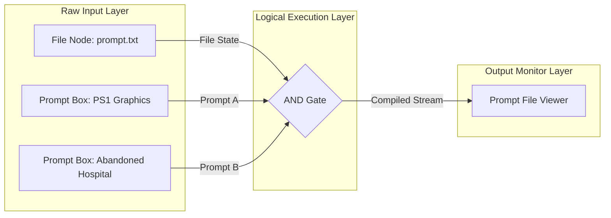

# ⚡ Prompt Logic Gates (PLG) IDE

[](https://github.com/WithSJ/Prompt-Logic-Gates-PLG-)

Prompt Logic Gates (PLG) is a revolutionary paradigm that shifts prompt engineering away from ad-hoc text editing and treats prompt construction as a discrete, visual **logical circuit**.

By visually routing text elements through logical operations, prompt engineers can systematically combine, filter, isolate, and debug prompt behaviors in real-time inside a beautiful visual compiler IDE.



---

## 🚀 Key Features

*   **⚡ Visual Prompt Programming**: Build prompts like logical circuits using custom React Flow nodes.
*   **⛓️ File Stream Baselines**: Pass robust prompt states (both positive and negative instructions) downstream through dedicated baselines.
*   **🎛️ Custom Logic Gates**:
    *   **AND Gate**: Merge prompt fragments dynamically.
    *   **OR Gate**: Toggle and alternate stylistic paths.
    *   **NOT Gate**: Remove unwanted concepts and append them to negative prompts.
*   **🔮 Live Compiler Engine**: See compiled output in real-time as you connect, disconnect, and tweak nodes.
*   **📚 obsidian-Compatible Compounding Wiki**: Full technical specifications and architecture design logs are built-in.

---

## 🛠️ Technology Stack

-   **Frontend**: React (v18) & Vite
-   **Visual Flow Library**: [@xyflow/react](https://reactflow.dev/) (React Flow)
-   **Icons**: Lucide React
-   **Styling**: Premium custom Vanilla CSS

---

## 📖 Complete Documentation & Wiki

All technical specifications, compiler logic, node parameters, and architectural guides are maintained in the local wiki. Check out the entry points below:

*   **[Wiki Catalog Entrypoint](wiki/index.md)** - Complete catalog of the visual logic wiki.
*   **[Vision & Concept Overview](wiki/overview.md)** - Core ideas, problems solved, and baseline mechanisms.
*   **[Compiler & Logic Specifications](wiki/compiler.md)** - Categories, keywords, semantic weights, conflict matrices, and AI prompts.
*   **[Architecture & Execution Flow](wiki/architecture.md)** - Reactive sync, execution topological sort order, and engine internals.
*   **[Nodes & Handles Guide](wiki/nodes.md)** - complete reference of input/output pins, custom logic elements, and node structure.
*   **[Workflows & Examples](wiki/workflows.md)** - Construction recipes, prompt circuit exports, and user guides.

---

## 💻 Getting Started

### 📋 Prerequisites

Make sure you have [Node.js](https://nodejs.org/) (v18+) installed.

### 📥 Installation

1. Clone the repository:
   ```bash
   git clone https://github.com/WithSJ/Prompt-Logic-Gates-PLG-.git
   cd Prompt-Logic-Gates-PLG-
   ```

2. Install dependencies:
   ```bash
   npm install
   ```

3. Run the development server:
   ```bash
   npm run dev
   ```

4. Build the application for production:
   ```bash
   npm run build
   ```

---

## 🤝 Contributing

Contributions to the Prompt Logic Gates IDE are highly appreciated! Please consult `AGENTS.md` for guidelines if you are using AI agents to modify the wiki or visual logic compilers, and feel free to open PRs or issues.

---

## 📄 License

This project is open-source. See the repository page for licensing details.
