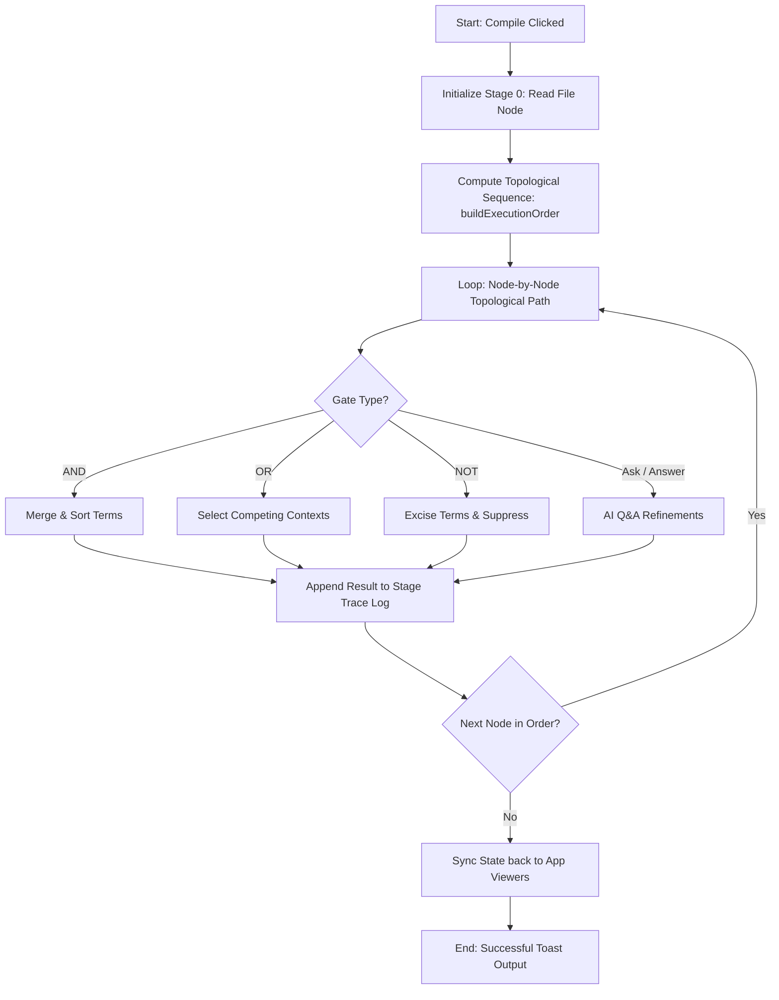

# PLG Compiler Engine & Visual Architecture

This document describes the technical implementation details of the PLG compiler frontend, the topological sorting logic, state propagation trackers, and the interactive UI event binds.

---

## 1. Visual Flow Engine (React Flow)

The visual workspace is built on **React Flow**, using custom node types registered under the `nodeTypes` mapping in [CustomNodes.jsx](file:///c:/Users/jadam/Desktop/PLG/src/components/CustomNodes.jsx).

The application coordinates data changes in a single active React component ([App.jsx](file:///c:/Users/jadam/Desktop/PLG/src/App.jsx)) using state hooks for `nodes`, `edges`, `settings`, and the compiled `compileResult`.

### Visual Core Specifications
*   **Persistent Workspaces**: The workspace automatically serializes the full visual layout (node coordinates, fields, connected edges) to LocalStorage under the key `plg_last_project`.
*   **Color-Coded Handles**: Ports represent strict data types:
    *   `var(--file)`: File Baselines (Grey/Silver).
    *   `var(--prompt)`: Raw prompt fragments (Light Blue/Cyan).
    *   `#fb923c`: Clarifying questions list arrays (Orange).

---

## 2. Topological Dependency Sorting

Because prompt logic circuits are directed graphs, the compiler must resolve the topological execution sequence before evaluating logic gates. This ensures that upstream dependencies (like a Prompt Concat operator) complete execution before the downstream gate (like an AND gate) runs.

This sequence is computed via `buildExecutionOrder(nodes, edges)` inside [semanticCompiler.js](file:///c:/Users/jadam/Desktop/PLG/src/compiler/semanticCompiler.js):

```javascript
export function buildExecutionOrder(nodes, edges) {
  const gates = nodes.filter(n => ['and', 'or', 'not', 'askQuestion', 'answerQuestions', 'promptConcat', 'promptToFile'].includes(n.type));
  
  // Traces upstream gate dependencies recursively along file, prompt, and questions lines
  ...
  
  const order = [];
  const visited = new Set();
  const temp = new Set();

  function visit(id) {
    if (visited.has(id) || !gates.find(g => g.id === id)) return;
    if (temp.has(id)) return; // Prevent cyclic loops
    
    temp.add(id);
    
    // Visit all transitive gate dependencies first
    const deps = dependencies[id] || [];
    deps.forEach(depId => {
      visit(depId);
    });
    
    temp.delete(id);
    visited.add(id);
    order.push(id);
  }

  gates.forEach(g => visit(g.id));
  return order;
}
```

This depth-first-search topological sorter guarantees that **Directed Acyclic Graph (DAG)** boundaries are respected, throwing away cycles silently to prevent browser execution hang-ups.

---

## 3. The State Execution Loop

When the user triggers the **Compile** button in the Topbar, [App.jsx](file:///c:/Users/jadam/Desktop/PLG/src/App.jsx) executes the compile flow in three sequential phases:



### State Variables & Trace Propagation
*   `gateStates`: An object dictionary mapping each visual Node ID to its resulting baseline state:
    `gateStates[nodeId] = { positive: "...", negative: "...", prompt_val: "..." }`
*   `activePositive` / `activeNegative`: Traced dynamically along input file pins on each step using `getFileInput(nodes, edges, gateId, gateStates)`:
    - If connected to `fileNode`, baseline variables initialize to empty strings.
    - If connected to an upstream gate, it retrieves that gate's recorded value from the `gateStates` dictionary.

---

## 4. Reactive Q&A Synchronization

A key UX feature is the **Ask AI Questions ➜ Provide Answers** dynamic connection:

1.  **React Sync Edge Hook**: When the user adds or modifies an edge connecting `AskQuestionNode` (questions output) to `AnswerQuestionsNode` (questions input), [App.jsx](file:///c:/Users/jadam/Desktop/PLG/src/App.jsx) fires a reactive synchronization hook:
    ```javascript
    useEffect(() => {
      setNodes((nds) => {
        // Automatically clones the active question strings array from the source
        // directly into the target node data model.
      });
    }, [edges]);
    ```
2.  **State Retention**: To prevent typing losses, typed answers are stored directly in the `AnswerQuestions` node data structure (`data.answers`). Re-compiling a modified graph does not erase the user's answers unless the input edge is disconnected!
