# Visual Context Memory System: Design & Reference Specification

The **Context Memory System** is a cornerstone of the Prompt Logic Gates visual compiler. Inspired by the advanced data-ingestion models of engines like **MemPalace**, it enables prompt circuits to ingest codebase files, API schemas, wikis, and markdown documents, indexing them client-side into a highly structured **Visual Context Memory Ledger**.

This ledger acts as a **strict semantic constraint** during prompt generation, guaranteeing that the compiled prompts utilize **exact, consistent, and unaltered code terms, functions, and variables**, while preventing hallucinatory inputs or casing errors.

---

## 🧠 1. Architectural Workspace Hierarchy

The `contextMemory` node organizes ingested files into a structured directory-like hierarchy similar to MemPalace. When files are loaded (via `FileReader` buffers), they are mapped to specific structural components:

```
+-----------------------------------------------------------+
|  🧠 Context Memory (codebase sync)                        |
+-----------------------------------------------------------+
|  [ Uploaded Files Ledger ]                                |
|  📁 Source Code: app.js (2.4k)                            |
|  📁 Data Schemas: config.json (1.1k)                      |
|                                                           |
|  [ Build Context Memory (AI / Fallback) ]                 |
|                                                           |
|  [ Context Memory Preview (.md) ]                         |
|  # 🧠 MEMPALACE-STYLE CONTEXT LEDGER                      |
|  ## 🏛 Workspace Hierarchy                                |
|  - **Wing: Source Code**                                  |
|    - **Room: `app.js`**                                   |
|  ## 💻 Code Signatures & Database Schemas                 |
|  - **`userId`** (camelCase Variable)                      |
|  - **`fetch_data(id)`** (Function Signature)              |
+-----------------------------------------------------------+
```

### The Ingestion Components:
*   **Wings (Source Categories)**: High-level logical compartments classifying the type of loaded resource (e.g., `Source Code`, `Data Schemas`, `Documentation`).
*   **Rooms (File Paths)**: The exact relative file path representing the specific file-level buffer loaded into memory.
*   **Halls (Logical Sections)**: Section headers or structural components within a Room mapping to specific blocks of logic or documentation rules.
*   **Drawers (Concept/Code Entries)**: Individual granular variables, constants, entity hints, schemas, or styling constraints extracted with 100% spelling and casing fidelity.

---

## 🤖 2. High-Fidelity Extraction Engines

PLG supports two visual extraction pipelines under the hood, depending on the active IDE mode:

### A. AI-Based Extraction Prompt (AI Mode)
When running in **AI Mode**, the system merges all loaded text buffers and executes a zero-shot indexing prompt on the selected LLM:

```text
You are a principal logic indexer and metadata database compiler, styled after the MemPalace indexing engine.
Your task is to analyze the provided source files (.md, .txt, .html, .json, .xml) and index them into an Visual Context Memory Ledger.
Extract all technical specifications with extreme precision and absolute preservation of casing, symbols, and syntax.

Structure the catalog under these Obsidian-friendly HSL headers:
# 🧠 MEMPALACE-STYLE CONTEXT LEDGER
## 🏛 Workspace Hierarchy (Wings & Rooms & Halls)
## 💻 Code Signatures, Variables & Database Schemas
## 🔑 Key Terms & Structured Entity Hints
## 🎨 Semantic Constraints & Style Rules
## 📌 System Rules & Casing Invariants
```

### B. Multi-Casing Lexical Parser (Offline Rule Mode)
If no AI keys are present or the IDE is configured for **Offline/Rule Mode**, the engine executes a lexical line-by-line scanner that extracts:
1.  **JSON Schema Keys**: Recursively crawls loaded `.json` buffers to extract keys and property locations.
2.  **Function Signatures**: Matches method signatures (e.g. `functionName(args)`) using `\b([a-zA-Z_][a-zA-Z0-9_]*\s*\([^)]*\))\b`.
3.  **Multi-Casing Variables**:
    *   `camelCase`: Matches variables like `userId`, `sessionToken` (`\b[a-z]+[A-Z][a-zA-Z0-9]*\b`).
    *   `PascalCase`: Matches class names or type objects (`\b[A-Z][a-z0-9]+[A-Z][a-zA-Z0-9]*\b`).
    *   `snake_case`: Matches standard parameter conventions (`\b[a-z0-9]+_[a-z0-9_]+\b`).
    *   `CONSTANT_CASE`: Matches global constants or immutable variables (`\b[A-Z0-9]+_[A-Z0-9_]+\b`).
4.  **Semantic Visual Rules**: Scans line buffers for rules or constraints by matching lexical triggers like `must`, `should`, `always`, `never`, `avoid`, `color`, `dimension`.
5.  **Key Terms**: Grabs bracketed markdown terms (`**term**` or `` `term` ``) to construct visual entity hints.

---

## ⚡ 3. Complete Prompt Design Expansion

If a connected or globally active Context Memory Ledger contains definitions for concepts, files, or variables referenced in the compiling prompt, the compiler **completely re-designs and expands the prompt baseline** to match the memory catalog rules.

### AI Expansion & Alignment Gate:
During topological compilation, if `contextMemory` is connected as an in-line alignment gate, it intercepts the prompt stream and instructs the LLM:
*   *Identify matched concepts*: Even loose or case-insensitive keyword matches (e.g. "mempalace recovery" or "agents logic") trigger expansion.
*   *Pull specifications*: Extract the corresponding Wing, Room, or Hall structural definitions from the ledger.
*   *Rewrite prompt completely*: Optimize and expand the prompt baseline to strictly use exact case-sensitive variables, function signatures, database schemas, and styling constraints defined in the memory room.

### Offline Rule-Based Prompt Expansion:
In offline mode, the compiler parses the Markdown memory ledger into a key-value rules map:
1.  **Casing Correction**: Automatically performs case-insensitive word searches on the baseline prompt, replacing loose terms with the exact, casing-sensitive representations (e.g. replacing `FetchData` with the exact signature `fetch_data(id)`).
2.  **Semantic Constraint Injection**: If the prompt baseline contains a matched memory term, the compiler extracts the associated rule description from the ledger and appends it as an active prompt constraint in parenthesized notation:
    $$\text{Prompt} = \text{Baseline Prompt} + \text{" (Memory Constraints: [[Term] rule: [Description]])"}$$
3.  This ensures that rule-based compiles remain 100% compliant with documentation without requiring external LLM tokens.

---

## 🔌 4. Global Memory Routing & Aggregation

Context Memory is designed as a **floating global memory bank**. Unlike typical logic operators, Context Memory nodes **do not require physical edge wiring or pin connections** to gates.

### A. Independent Toggle Switches (On/Off Controls)
Each Context Memory node placed on the canvas is fully independent and is equipped with a visual glassmorphic **Active / Inactive** toggle switch. 
*   **Active (✓ ENABLED)**: The node's compiled HSL ledger is read and integrated during prompt generation.
*   **Inactive (✗ DISABLED)**: The node is temporarily bypassed. Its ledger text is ignored during compile cycles, and the node's visual style is greyed out.

### B. Global Aggregation Formula
During a compilation run, the compiler scans the canvas and locates **all active, enabled Context Memory nodes**. It reads the extracted markdown ledgers from each enabled bank, filtering out empty ones, and merges them into a single consolidated context ledger using a double newline separator:

$$\text{Global Memory Content} = \bigcup_{\text{enabled } i} \text{Ledger}_i$$

This allows prompt engineers to load multiple independent libraries (e.g. one node containing `api-signatures.js`, another containing `css-tokens.css`, and a third containing `general-invariants.md`), toggling them on and off individually as needed.

### C. Visual Layout
The global nodes float independently on the React Flow workspace, and are read automatically by compiling gates, removing edge clutter:

```mermaid
graph TD
    subgraph Global Memory Banks
        CM1["🧠 Context Memory A (Active)"]
        CM2["🧠 Context Memory B (Inactive)"]
        style CM1 fill:#f3e8ff,stroke:#c084fc,stroke-width:2.5px;
        style CM2 fill:#19232e,stroke:#5c6f7e,stroke-width:1px,stroke-dasharray: 4;
    end

    subgraph Wired Prompt Circuit
        FileNode["File Node (prompt.txt)"] -- file --> AND["AND Gate"]
        PromptBox["Prompt Box ('retrieve data')"] -- prompt --> AND
        AND -- file --> FileViewer["👁 Prompt File Viewer"]
    end

    CM1 -. global read on compile .-> AND
```



---

## ⚖️ 5. Inspector Pipeline Debugger & Verification

At the end of the semantic compilation pipeline, a dedicated **Context Memory Verification** card runs:
*   **Exact Term Scans**: Performs a final scan of the fully compiled prompt against the extracted memory terms.
*   **Visual Status Feedback**:
    *   `✓ Checked and matched [N] exact memory term(s)` (Green ok check) if exact casing matches are verified.
    *   `⚠ Context Memory loaded but no exact terms matched` (Amber warning) if memory is loaded but the prompt has failed to utilize any of the indexed variables or casing invariants.
    *   `No Context Memory Node active` (Grey info card) if no memory is loaded on the canvas.

This verification pipeline ensures developers can debug casing mismatches or missing logic references before exporting prompts to production.
