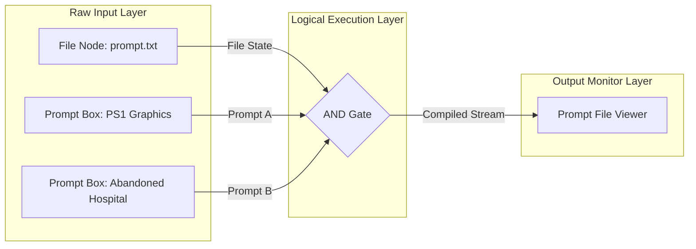

# PLG Overview: Semantic Prompt Logic Gates

Prompt Logic Gates (PLG) is a revolutionary paradigm that shifts prompt engineering away from ad-hoc text editing and treats prompt construction as a discrete, visual **logical circuit**.

By visually routing text elements through logical operations, prompt engineers can systematically combine, filter, isolate, and debug prompt behaviors in real-time.

---

## 💡 The Core Problem

Traditional prompt construction relies on raw text blocks:
*   **Monolithic Files**: Large, hard-to-maintain text files where adding one style modifier can break another instruction.
*   **Zero Semantic Compilation**: No compile-time checks for style incompatibilities (e.g. asking for a photo-realistic cartoon).
*   **Lack of Traceability**: If a generated image fails, it is difficult to determine which specific sub-concept or modifier caused the breakdown.

---

## ⚡ The PLG Paradigm: Prompts as Code

In PLG, prompts are treated as a compiled software artifact:

PLG splits this into three primary concepts:

### 1. The File Stream Baseline
Instead of just working with standalone strings, prompt logic flows along a **File Stream baseline**. This stream carries the accumulated state of the prompt:
*   `activePositive`: The cumulative prompt instructions, carrying both positive directives and explicit negative suppression rules.

### 2. Logic Operators (Gates)
Logic operators intercept this file baseline stream, execute local transformations, and emit a modified baseline down the chain:
-   `AND Gate`: Synthesizes and merges new prompt fragments into the active stream.
-   `OR Gate`: Compares two competing stylistic directions against the baseline context and selects the best fit.
-   `NOT Gate`: Excises positive terms and appends explicit negation instructions (e.g. *avoid [concept]*) to specify what the model must not include.

### 3. Type Converters
Since visual nodes can pass both **File Baselines** (carrying the prompt state) and **Prompt Text Fragments** (raw string clips), converter nodes route boundaries between these channels:
*   `File to Prompt`: Converts the active state of a file stream into a raw text fragment to feed into an input pin.
*   `Prompt to File`: Overwrites a file baseline using a raw text fragment input.

---

## 🎯 Primary Applications

*   **Complex Text-to-Image Generation**: Decoupling scene subjects, environments, camera settings, and grain effects into isolated nodes.
*   **Prompt Regression Testing**: Iteratively toggling gates on/off in the visual IDE to isolate exactly which prompt fragment triggers negative model behaviors.
*   **AI-Guided Prompt Development**: Utilizing conversational Q&A gates directly inline to automatically expand on prompt details.

---

## 🔗 Core Wiki Connections

To navigate the visual prompt logic gates specification, trace these primary reference hubs:
*   [[Visual Compiler Engine](compiler.md)] - Parser categories, scoring algorithms, and AI compiler prompts.
*   [[Workspace Execution Architecture](architecture.md)] - Topological sorting, React Flow canvases, and state binders.
*   [[Custom Nodes & Handles API](nodes.md)] - Detailed specifications of all inputs, outputs, and logic pins.
*   [[Context Memory System](memory.md)] - MemPalace-style file ingestion, casing crawlers, and rule alignment.
*   [[Visual Circuit Workflows](workflows.md)] - Guide to building, debugging, exporting, and loading prompt circuits.
