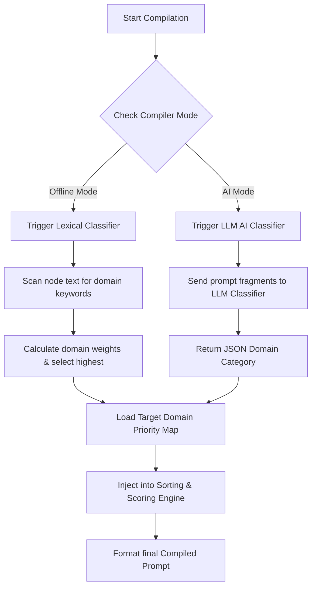

# Multi-Domain Prompt Priority Schema & Priority Manager

In advanced prompt engineering, a single priority schema does not fit all tasks. A layout optimal for generating digital art (where lighting and camera angles reign supreme) is fundamentally incompatible with software development prompts (where language syntax and error stack traces must take ultimate precedence).

To solve this, the Prompt Logic Gates (PLG) compiler employs a **Multi-Domain Prompt Priority Schema** governed by an automated **Priority Manager**. This system dynamically classifies the prompt circuit's target purpose and loads the corresponding priority weight mappings to construct perfectly structured LLM briefs.

---

## 1. Domain-Specific Dimensional Priorities

The PLG engine supports five core compilation domains, each with nine distinct structural dimensions. The priority weights determine their top-sort ordering and affinity score coefficients during compilation.

### A. Image Generation Domain (`domain: image`)
Optimized for text-to-image generators (e.g., Stable Diffusion, Midjourney) by ranking core characters first, visual styling intermediate, and lens/render configurations last.

| Dimension Name | Identifier | Priority | Key Vocabulary & Token Matches |
| :--- | :--- | :---: | :--- |
| **Subject** | `subject` | `100` | man, woman, portrait, creature, zombie, dragon, robot, building |
| **Environment** | `environment` | `90` | forest, hospital, city, ruins, space, laboratory, ocean, mountain |
| **Action** | `action` | `80` | running, screaming, standing, floating, dancing, fighting, looking |
| **Emotion** | `emotion` | `70` | scary, eerie, unsettling, peaceful, dramatic, melancholic, epic |
| **Lighting** | `lighting` | `60` | dark, candles, moonlight, neon, volumetric, sunrays, soft studio |
| **Style** | `style` | `50` | realistic, ps1, retro, low-poly, watercolor, oil painting, sketch |
| **Detail** | `detail` | `45` | highly detailed, 8k, photorealistic, intricate, cinematic |
| **Camera** | `camera` | `40` | close-up, wide-shot, fisheye, macro, top-down, side-view, pov |
| **Effects** | `effects` | `30` | film grain, particles, glitch, vignette, bloom, chromatic aberration |

---

### B. Code Generation & Programming Domain (`domain: code`)
Optimized for code generation LLMs. It ensures the environment rules and the target logical functions are established before applying style preferences and unit testing rules.

| Dimension Name | Identifier | Priority | Key Vocabulary & Token Matches |
| :--- | :--- | :---: | :--- |
| **Language & Env** | `lang_env` | `100` | python, rust, javascript, typescript, react, node, v18, compile, runtime |
| **Core Functionality**| `functionality`| `95` | function, method, class, API fetch, endpoint, algorithm, sorting, route |
| **I/O & Data Structure**| `io_structure` | `85` | JSON payload, schema, parameters, return type, string, database, array |
| **Performance Rules**| `constraints` | `75` | fast, memory limit, time complexity, O(1), no dependencies, lightweight |
| **Coding Standards** | `standards` | `65` | clean code, modular, SOLID, DRY, Airbnb style, OOP, functional programming |
| **Edge Cases** | `edge_cases` | `55` | null pointer, undefined, exception, fallback, timeout, empty array |
| **Third-Party Libs** | `libraries` | `45` | lodash, axios, tailwind, redis, express, mongoose, pandas, NumPy |
| **Testing** | `testing` | `35` | unit test, jest, pytest, test suite, mock, assertion, coverage |
| **Docs & Comments** | `documentation`| `25` | JSDoc, inline comments, docstrings, readme, markdown, swagger |

---

### C. Bug Finding & Debugging Domain (`domain: debug`)
Optimized for diagnostic tasks. It places the immediate point of failure (error messages) and the broken code snippet at the forefront of the prompt so the LLM focuses its analytical power there.

| Dimension Name | Identifier | Priority | Key Vocabulary & Token Matches |
| :--- | :--- | :---: | :--- |
| **Error & Stacktrace**| `error_stack` | `100` | TypeError, NullPointerException, SyntaxError, crash, uncaught exception |
| **Failing Code** | `failing_code` | `95` | block of code, function snippet, index.js, line 42, failing method |
| **Expected Behavior** | `expected` | `85` | should return, expected behavior, goal, target output, expected to |
| **Actual Behavior** | `actual` | `80` | actually returns, undefined behavior, incorrect output, freezing |
| **Environment State** | `env_state` | `70` | OS version, node version, chrome devtools, local storage, docker container |
| **Recent Changes** | `recent_changes`| `60` | git diff, commit history, changed file, updated package, refactored |
| **Attempted Fixes** | `attempts` | `50` | already tried, tried replacing, attempted solution, doesn't work |
| **Diagnostics & Logs** | `logs` | `40` | console.log, network payload, stack trace, db query, print, debug log |
| **Resolution Constraints**| `constraints` | `30` | hotfix only, no refactoring, legacy-compatible, avoid breaking changes |

---

### D. Software Architecture & System Design Domain (`domain: architecture`)
Optimized for high-level technical proposals. It prioritizes system scale constraints and organizational goals before deciding on concrete tech stacks or deployment specifications.

| Dimension Name | Identifier | Priority | Key Vocabulary & Token Matches |
| :--- | :--- | :---: | :--- |
| **Goals & Scale** | `goals_scale` | `100` | 10M DAU, latency, throughput, scale, goals, highly available, business |
| **Arch Pattern** | `patterns` | `90` | microservices, monolith, serverless, MVC, event-driven, pub-sub |
| **Data & Storage** | `data_storage` | `80` | SQL, PostgreSQL, NoSQL, MongoDB, Redis cache, indexing, replica |
| **Tech Stack** | `platforms` | `70` | AWS, Kubernetes, Docker, Node.js, Go, Python, cloud infrastructure |
| **Quality Attributes** | `quality_attr` | `60` | scalability, reliability, portability, maintainability, extensibility |
| **APIs & Protocols** | `protocols` | `50` | REST API, GraphQL, gRPC, WebSockets, Kafka message broker, HTTP/2 |
| **Security Rules** | `security` | `40` | OAuth2, JWT, GDPR compliance, encryption, SSL, firewall, IAM |
| **CI/CD & DevOps** | `devops` | `30` | pipeline, deployment, GitHub Actions, Prometheus, Grafana, monitoring |
| **Budget & Cost** | `cost` | `20` | server cost, budget constraints, minimal resources, pricing, cloud expense |

---

### E. GUI & UI/UX Design Domain (`domain: gui`)
Optimized for front-end visual prompt engineering. It puts spatial layouts, grids, and responsive constraints first, followed by visual brand tokens, interaction transitions, and frameworks.

| Dimension Name | Identifier | Priority | Key Vocabulary & Token Matches |
| :--- | :--- | :---: | :--- |
| **Layout & Grid** | `layout` | `100` | responsive, desktop, mobile, grid system, flexbox, sidebar, container |
| **UI Components** | `components` | `90` | navbar, dashboard card, modal dialog, form, button, tooltip, table |
| **Theme & Palette** | `theme` | `80` | dark mode, color palette, primary cyan, gradient, glassmorphism, HSL |
| **Typography** | `typography` | `70` | font family, Inter, typography scale, font weight, line height, header |
| **Transitions & Hover**| `interactions` | `60` | hover animation, active state, micro-animation, spinner, fade in |
| **Frameworks** | `framework` | `50` | Tailwind CSS, pure Vanilla CSS, React Flow, Material UI, Bootstrap |
| **Accessibility** | `a11y` | `40` | ARIA landmarks, alt text, screen reader, color contrast, keyboard-safe |
| **Spacing & Gaps** | `spacing` | `30` | padding, margin, border radius, gap-4, auto alignment, layout flow |
| **Icons & Media** | `assets` | `20` | SVG icons, Lucide, avatar image, placeholder image, logo vector |

---

## 2. Priority Manager Architecture

The **Priority Manager** (`PriorityManager`) sits directly in the compilation pipeline. It intercepts the canvas node-graph data, determines the active domain, and serves the corresponding dictionary to the compiler.



### A. Classification Protocols

The classification execution pathway adapts to the user's selected **Compiler Mode** setting:

#### Pathway 1: Offline Classification (Rule-Based)
If the compiler mode is set to **Normal** (or when AI endpoints are bypassed), the Priority Manager runs a fast, lightweight lexical crawler:
1. It loops through all node `text` and `fileViewer` inputs.
2. It tests strings against a regex catalog mapped to each domain:
   * **Code Regex**: `/(function|import|class|def |fn |let |const|typescript|rust|compile|runtime)/i`
   * **Debug Regex**: `/(Error|Exception|stacktrace|bug|crash|at line|console\.log|expected behavior)/i`
   * **Architecture Regex**: `/(architecture|microservices|scalability|high availability|throughput|Kubernetes)/i`
   * **GUI Regex**: `/(navbar|sidebar|Tailwind|flexbox|grid|CSS|hover|padding|margin|Typography)/i`
   * **Image Regex**: Default fallback, or explicitly matches words like `/(photorealistic|lighting|volumetric|camera|oil painting|render)/i`
3. The domain scoring the highest total keyword overlap is dynamically loaded as the active compiling profile.

#### Pathway 2: AI Classification (LLM-Based)
If the compiler mode is set to **Thinking** or **DeepThinking** with an active LLM provider, it issues a single structured classification query to the API:

*   **System Prompt**:
    ```text
    You are the dynamic Priority Manager for a multi-domain prompt-building IDE. 
    Your job is to analyze the raw, connected prompt fragments and classify the overall target task into exactly ONE of these five categories:
    - "image" (digital art, visuals, rendering directives)
    - "code" (writing code, software functions, algorithmic logic)
    - "debug" (solving bugs, analyzing errors, fixing stack traces)
    - "architecture" (designing system systems, DB schemas, hosting patterns)
    - "gui" (web UI layouts, CSS themes, front-end grid alignments)

    You must respond with STRICT JSON containing only your selection and a brief logic description:
    {"domain": "image" | "code" | "debug" | "architecture" | "gui", "reason": "Your brief classification logic"}
    ```
*   **User Input**:
    ```text
    Analyze these prompt fragments:
    "{consolidatedFragments}"

    Return JSON:
    ```

---

## 3. Compilation Pipeline Integration

During a compile cycle (`compileGraph` in `semanticCompiler.js`), the Priority Manager replaces the hardcoded `100-to-30` image priority weights with the dynamically classified domain weights.

### Sorting & Scoring Adjustment
The compiler's context alignment score calculation dynamically incorporates the loaded domain's category priorities:

$$\text{Score} = (\text{Overlap Tokens} \times 2) + \text{Category Affinity} + \left(\frac{\text{DomainPriority}}{100}\right) - \text{Conflicts Penalty}$$

Where:
* **DomainPriority**: The dynamic priority weight (e.g., `95` for code functionality if `domain: code` is active).
* **Category Affinity**: Triggered when incoming terms align with the specific keywords of the dynamically classified domain.

---

## 🗺️ Graph Connections
- [[Overview](overview.md)]
- [[Compiler Engine](compiler.md)]
- [[Nodes Reference](nodes.md)]
- [[Workflows](workflows.md)]
