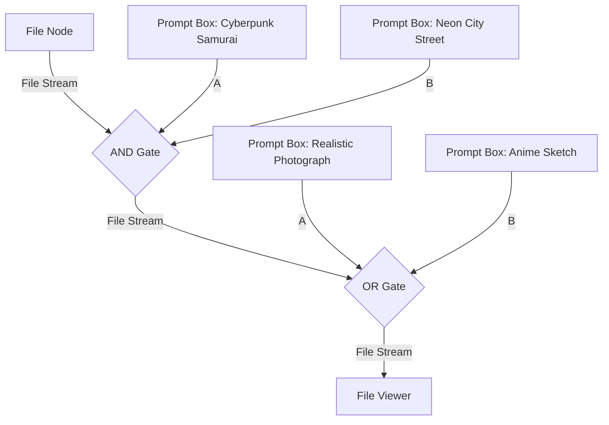
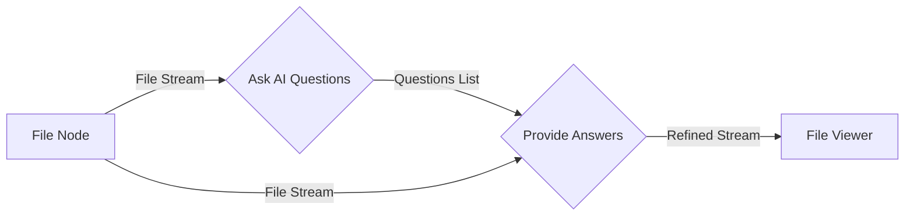

# Visual Workflows & Tutorials

This page is a practical guide mapping common visual workflow patterns inside the PLG IDE.

---

## 🚀 Getting Started: The Default Template

When you open the IDE, a default seed template loads automatically to show you the basic structure of a prompt flow circuit. It includes:
- **File Node** (`prompt.txt`)
- **Prompt Boxes** for `Abandoned hospital` and `PS1 graphics`
- **AND Gate** merging them
- **NOT Gate** suppressing `cute cartoon style`
- **Prompt File Viewer** displaying the result

---

## 🎨 Workflow A: Multi-Style Composition (AND & OR Gates)

Use this pattern when you want to compose a scene subject with environmental modifiers and choose between competing style directions.

### Steps to Build
1.  **Add Baseline**: Drag in a `File Node` and label it `cyber-samurai.txt`.
2.  **Add Scene Details**: Drag in two `Prompt Boxes` (e.g. `cyberpunk samurai, dual katanas` and `rain-slicked neon street, towering skyscrapers`).
3.  **Merge Details**: Drag in an `AND Gate`. Connect the File Node's source pin to the AND gate's file input pin. Connect Prompt Box 1 to `a` and Prompt Box 2 to `b`.
4.  **Add Style Candidates**: Drag in two additional Prompt Boxes containing competing style directives (e.g., `realistic photo, raytraced` vs `vintage anime sketch, Hokusai woodblock`).
5.  **Choose Best Compatibility**: Drag in an `OR Gate`. Route the AND gate's output baseline pin to the OR gate's file baseline pin. Connect style candidate A to OR's `a` input, and style candidate B to OR's `b` input.
6.  **Evaluate**: Connect the OR gate's baseline output to the `Prompt File Viewer` target pin and click **Compile**.
    - *Rule Mode*: The compiler evaluates context overlap and keeps the style candidate that has the highest semantic affinity (e.g. matches similar aesthetic tones).
    - *AI Mode*: AI reads the entire cyberpunk samurai scene and selects the candidate that matches the narrative tone, outputting a brief single-sentence reason.

---

## 🛑 Workflow B: Isolated Concept Suppression (NOT Gate)

Use this pattern when you want to explicitly suppress a specific style, object, or color, forcing it out of the positive prompt and routing it into negative memory.

### Steps to Build
1.  Drag in an `AND Gate` compiling a scene (e.g. `dark medieval gothic cathedral, atmospheric mist`).
2.  Drag in a new `Prompt Box` containing the concept you want to forbid (e.g. `bright neon lights`).
3.  Drag in a `NOT Gate`.
4.  Route the AND gate output baseline stream to the NOT gate's file input. Connect the forbidden Prompt Box to the NOT gate's `a` input handle.
5.  Route the NOT gate output baseline to the `Prompt File Viewer`.
6.  Click **Compile**:
    - The positive prompt window in the viewer will show a sanitized positive prompt (stripping any accidental terms related to `neon` or `bright`).
    - The negative prompt window will show `bright neon lights` added to the suppression array.

---

## 💬 Workflow C: Interactive AI Prompt Clarification (Q&A Loop)

Use this pattern when you have a basic concept but want to use interactive AI questioning to refine details (e.g., framing, camera focal length, color grading) directly inline.

### Steps to Build
1.  Drag in a `File Node` and a `Prompt Box` containing a simple starter prompt (e.g. `a lonely explorer on Mars`). Connect them using an `AND Gate` or `Prompt to File` converter.
2.  Drag in an `Ask AI Questions` node.
3.  Connect the baseline file output stream to the `Ask AI Questions` file input handle.
4.  Configure the question count to `3`. Click **Compile** to generate three questions tailored to the Mars explorer scene.
5.  Drag in a `Provide Answers` node.
6.  Connect the `Ask AI Questions` source handle `questions` (Orange) to the target handle `questions` (Orange) of the `Provide Answers` node.
7.  Connect the primary file baseline output to the `Provide Answers` file target handle.
8.  You will immediately see the generated questions appear inside the input boxes of the `Provide Answers` node!
9.  Type your desired answers in each field (e.g., Q1: *Wide cinematographic shot*, Q2: *Sunset orange sky*, Q3: *Retro-futuristic space suit*).
10. Route the baseline output stream of `Provide Answers` to the `Prompt File Viewer` target pin.
11. Click **Compile**. The compiler will read your inputs and merge them into a single, beautifully structured prompt.

---

## 💾 Saving & Exporting Circuits

*   **Saving Layouts**: Click the **Save** button in the top bar. This compiles the visual node coordinates and text fields into a local `.json` file (`plg-graph.json`) and downloads it to your machine.
*   **Loading Layouts**: Click the **Load** button and select a previously saved `plg-graph.json` file. The workspace will restore all connections and node values automatically.
*   **Exporting TXT**: Click the **Compile** button to run compiler stages. Then, click **Export TXT** to download a finalized `.txt` file containing the compiled positive and negative prompts.
